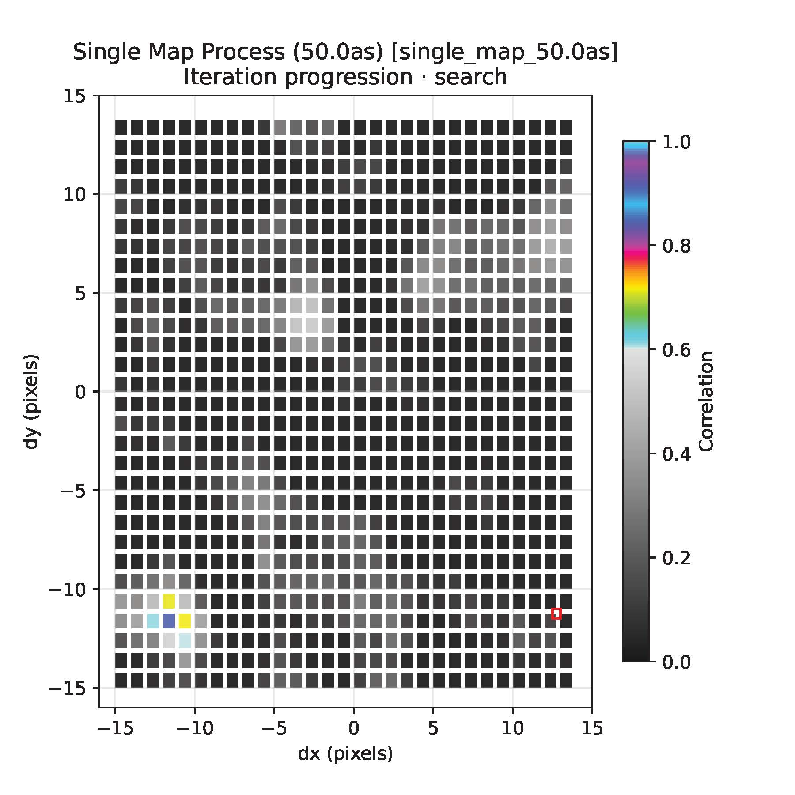
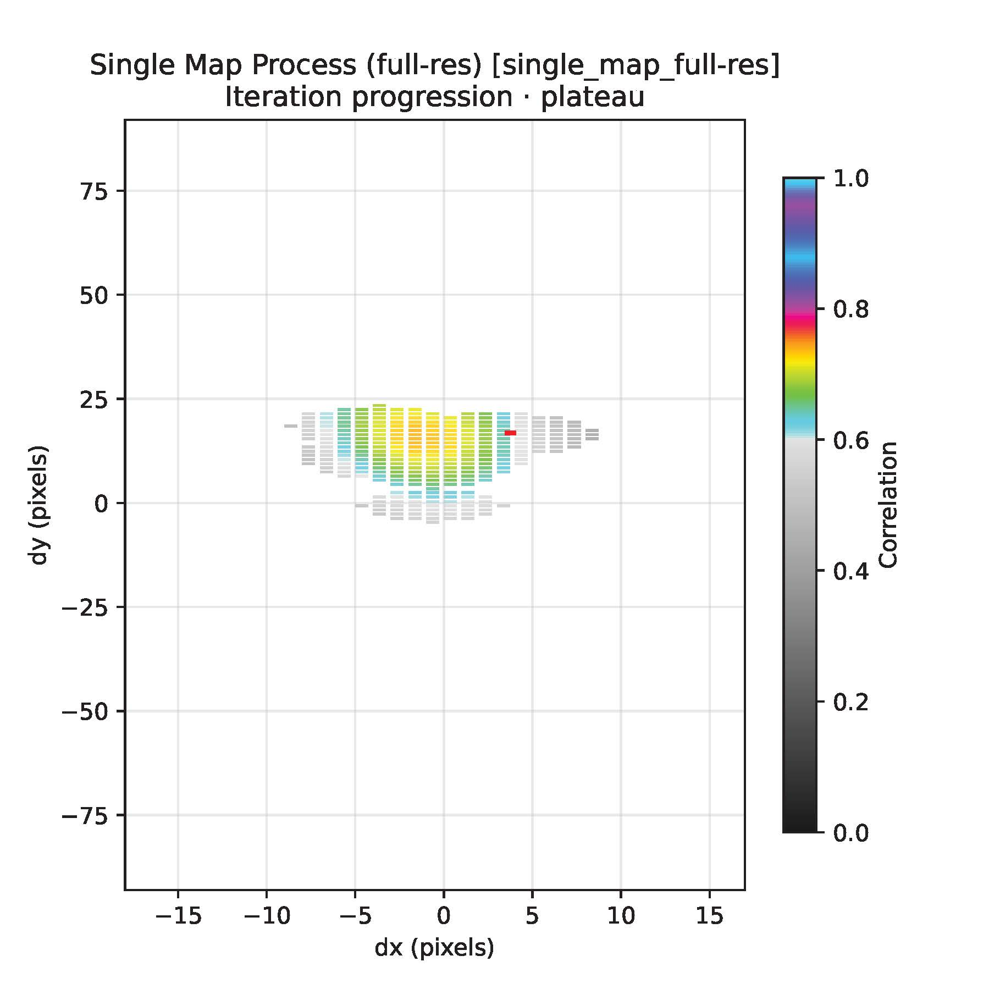
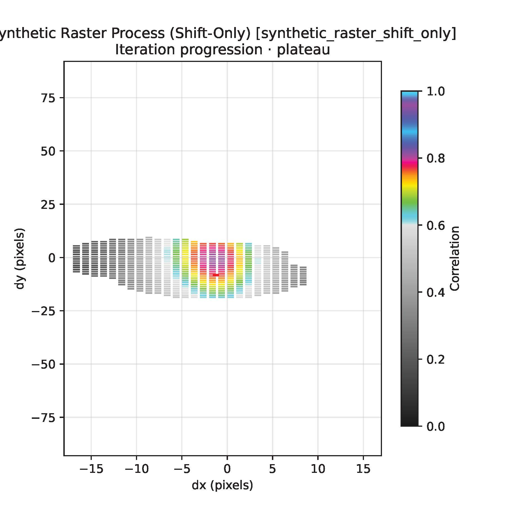
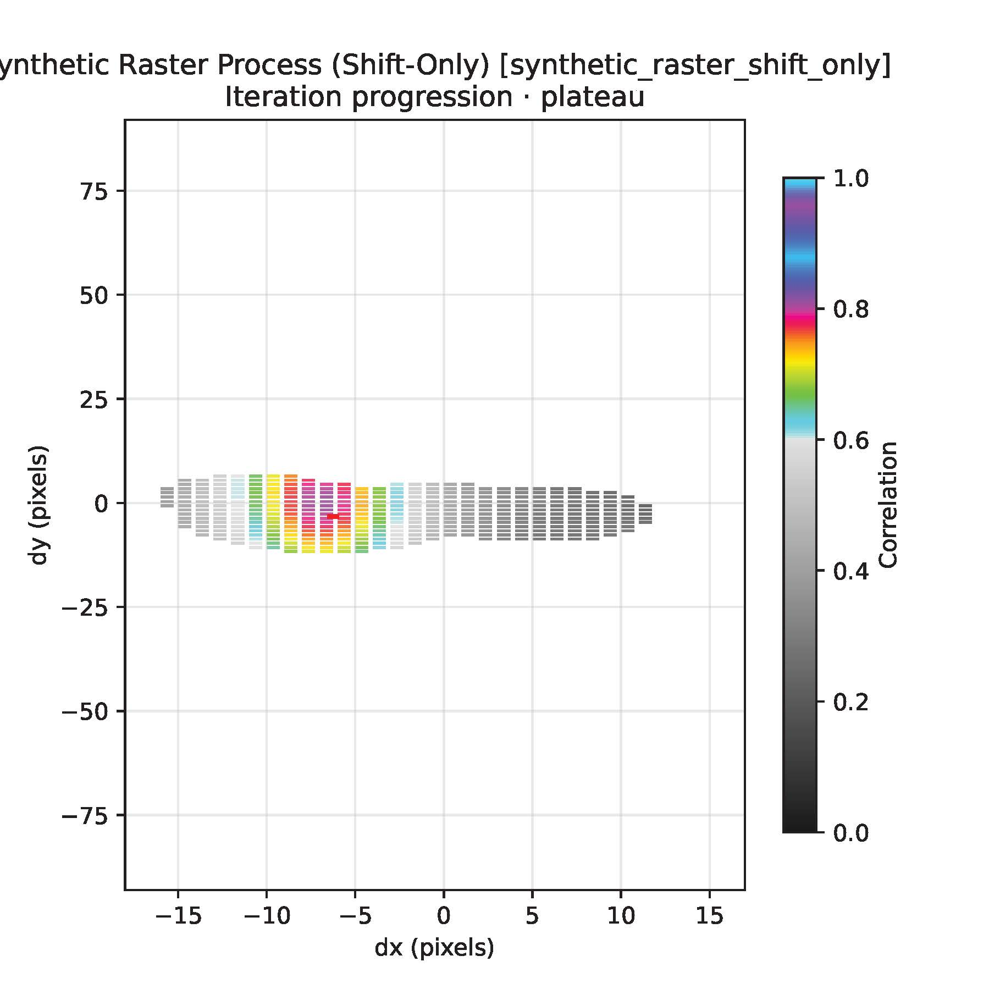
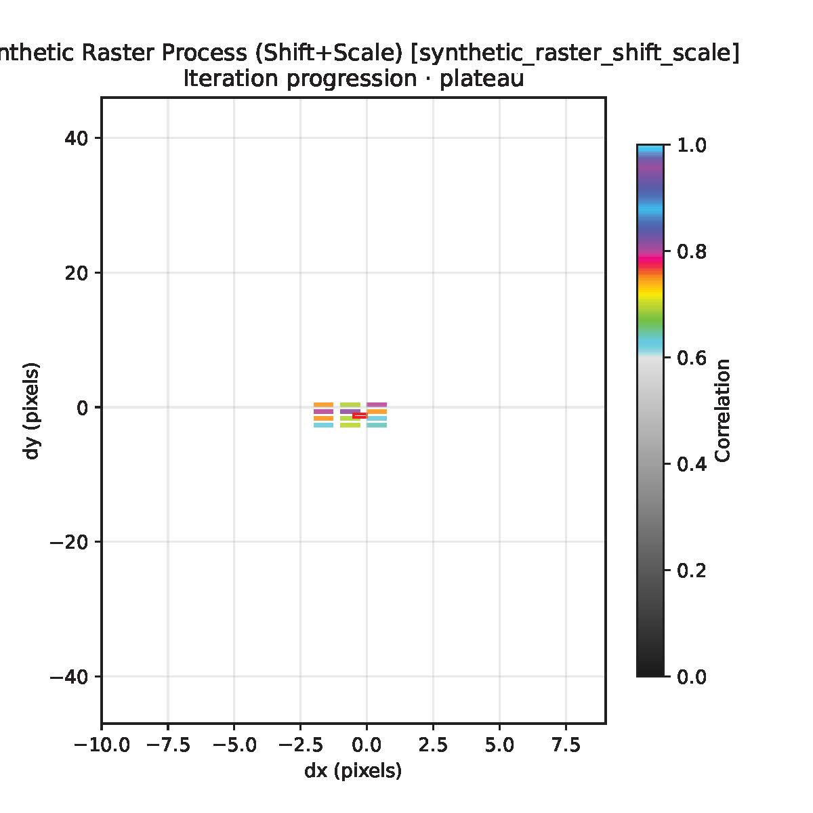

# SunXCorr - Usage, Development, and Tutorials

[](https://github.com/slimguat/SunXCorr/releases) [](https://pypi.org/project/SunXCorr) [](https://github.com/slimguat/SunXCorr/blob/main/LICENSE) [](https://github.com/slimguat/SunXCorr/actions) [](https://www.python.org) [](https://github.com/slimguat/SunXCorr/issues)

SunXCorr is a compact Python toolkit for automated cross-correlation and WCS correction of solar FITS images. It computes relative translations (and optional small scale adjustments) between SunPy maps and updates WCS metadata.

# Cross-correlation and WCS Correction

## Credits / Inspiration
This work was inspired by open-source alignment tools and code snippets by:
- [Antoine Dolliou](https://github.com/adolliou/euispice_coreg)
- [Gabriel Pelouze](https://git.ias.u-psud.fr/gpelouze/align_images/-/tree/master)
- [Frédéric Auchère](http://git.ias.u-psud.fr/fauchere)

This repository (SunXCorr) contains tools for cross-correlation and coalignment of solar images. The README documents how to set up, run, test, and develop the project, and includes tutorials showing common workflows.

## Table of contents
- [Quick start](#quick-start)
- [Setup (env + deps)](#setup-env-deps)
- [How the algorithm works (high level)](#how-the-algorithm-works)
- [Tests and static checks (mypy, pre-commit, pytest)](#tests-and-static-checks)
- [Development workflow](#development-workflow)
- [Tutorials](#tutorials)
- [Troubleshooting](#troubleshooting)

---

<a name="quick-start"></a>
## Quick start

1. Clone the repository and change into the project folder.

Standard clone (downloads Git LFS objects automatically if LFS is enabled):

```bash
git clone https://github.com/slimguat/SunXCorr.git SunXCorr
cd SunXCorr
```

Optional: skip downloading large test/example files managed by Git LFS during clone. This is useful if you only want the code and will fetch large data later when needed:

```bash
# Clone without automatically downloading LFS-managed files
# Linux / macOS (bash/zsh)
GIT_LFS_SKIP_SMUDGE=1 git clone https://github.com/slimguat/SunXCorr.git SunXCorr
cd SunXCorr

# Windows PowerShell
$env:GIT_LFS_SKIP_SMUDGE = '1'; git clone https://github.com/slimguat/SunXCorr.git SunXCorr
cd SunXCorr

# Windows (cmd.exe)
set GIT_LFS_SKIP_SMUDGE=1
git clone https://github.com/slimguat/SunXCorr.git SunXCorr
cd SunXCorr

# When you later need the LFS objects for tests or examples, enable LFS locally and pull them.
# Install git-lfs via your platform package manager if missing (examples below).
git lfs install --local
git lfs pull

# To fetch only specific paths, use include/exclude filters, for example:
# git lfs pull --include="fits_files/**"
```

2. Create and activate a Python 3.11 virtual environment (recommended).

Linux / macOS (bash / zsh):

```bash
python -m venv .venv
source .venv/bin/activate
python -m pip install --upgrade pip
```

Windows PowerShell:

```powershell
python -m venv .venv
. .venv\Scripts\Activate.ps1
python -m pip install --upgrade pip
```

Windows (cmd.exe):

```cmd
python -m venv .venv
.\.venv\Scripts\activate
python -m pip install --upgrade pip
```

Note: PowerShell may block running scripts by default. If `Activate.ps1` is blocked you can either use the `cmd.exe` activation above or run in PowerShell once:

```powershell
Set-ExecutionPolicy -Scope CurrentUser -ExecutionPolicy RemoteSigned -Force
```

3. Install runtime dependencies.

```bash
pip install .
# or for an editable install during development and for testing.
pip install -e .
```

4. Verify the installation by importing the package in Python:

```bash
python -c "import sunxcorr; print('sunxcorr import OK')"
```


---

<a name="how-the-algorithm-works"></a>
## How the algorithm works (high level)

SunXCorr uses cross-correlation to find the best relative shifts (and optionally scales) between a target map and a reference map or between a target map and a synthetic raster built from multiple maps.

- Cross-correlation is performed either in single-map mode (shift-only search) or in synthetic-raster mode (shift + scale search).
- SingleMap processes perform translations (shifts) only and do not rescale the image. They can search a wider shift space, which makes them robust when the reference map is larger than the target.
- SyntheticRaster processes include scale corrections and operate on maps of the same size as the target - therefore their allowed shift search space must be smaller than the map size.

FITS metadata requirements (important): map metadata must contain time and axis information for correct handling and output updates:

- `CRVAL3`: a float representing the time reference value in seconds to `DATE-REF`.
- `CDELT3`: typically `1` (units per pixel along the time axis).
- `CUNIT3`: e.g. `"s"` for seconds.
- `PC3_1` (or appropriate WCS PC matrix entries): may be used to encode exposure/scan direction (exposure time is negative if the scan direction is anti-x-direction).

<!-- JIT-accelerated functions: the `sunxcorr` package provides typed-Python implementations and optional `numba` wrappers for runtime acceleration. The first call to a numba-jitted function warms up the JIT and may take longer; subsequent calls are faster. -->

Example usage (Python):

```python
from sunxcorr.correlation_jit import correlation_for_params_jit
import numpy as np

# Prepare small synthetic maps (see tests for examples)
map1 = np.ones((64, 64), dtype=np.float32)
map2 = np.ones((64, 64), dtype=np.float32)

result = correlation_for_params_jit(map1, map2, dx=0.0, dy=0.0, squeeze_x=1.0, squeeze_y=1.0)
print(result)
```

---

<a name="tests-and-static-checks"></a>
## Tests and static checks

Git LFS note: some large data used by tests and examples (`fits_files/` assets) are stored with Git LFS. After cloning you must fetch the LFS objects before running tests that depend on these files:


```bash
# clone the repository (example shown earlier in Quick start)

# Ensure `git-lfs` is installed. Examples:
# Linux (Debian/Ubuntu): sudo apt install git-lfs
# macOS (Homebrew): brew install git-lfs
# Windows (Chocolatey): choco install git-lfs

# Initialize LFS for this repository (run inside the repo):
git lfs install --local

#- Install development/test dependencies.

# Using Poetry (recommended):

poetry install --with dev
# or for older Poetry: poetry install --dev
# Or with pip (venv active):
# pip install -e .   # if not already done
pip install -U pytest       # ensure pytest is available
```


# Download the LFS-managed files referenced by the current checkout
git lfs pull

# now run the quick tests (the quick runner avoids pytest collection issues)
python tests/run_tests_quick.py
# or run the full pytest suite
python pytest  # use -q for quiet, -v or -vv for increased verbosity
```


Notes:
- If `git lfs` is not available, install it (e.g. `apt install git-lfs` or `brew install git-lfs`) and re-run `git lfs install`.
- Alternatively, to avoid auto-downloading LFS objects during clone, you can clone with `GIT_LFS_SKIP_SMUDGE=1 git clone https://github.com/slimguat/SunXCorr.git` and then run `git lfs pull` inside the repo to retrieve objects when needed.

- If you run tests immediately after cloning without pulling LFS objects, tests will likely fail because example data files are missing.

If `pytest` hangs during collection due to heavy imports (e.g., `astropy`), use the quick runner or run individual tests to isolate failures.

---

<a name="tutorials"></a>
## Tutorials

Below we provide compact, practical tutorials for the most common workflows: single-map cross-correlation, synthetic-raster correlation, and an orchestrated multi-step pipeline.

Algorithm overview (read before running examples):

- Cross-correlation finds the best relative translation (and optionally scale) between maps by computing similarity metrics over a search grid.
- Single-map workflows only search for translations (shifts). They can explore large shift spaces since the reference map may be larger than the target.
- Synthetic-raster workflows include scale search (scale is unitless; 1.0 = no scale). Synthetic rasters are the same size as the target, so their shift search range must be smaller than the map dimensions.

### Cross-correlation with a single map

Preparation: have two maps and the paths available, e.g. `Path/to/your/reference_map.fits` and `Path/to/your/target_map.fits`. The goal is to correct the `target_map` using the `reference_map`.

Example (Single map class usage):

```python
from sunxcorr import SingleMapProcess
import astropy.units as u
from sunpy.map import Map
from pathlib import Path

xcorr_single = SingleMapProcess(
	max_shift=100.0 * u.arcsec,        # required: astropy Quantity
	bin_kernel=1.0 * u.arcsec,         # required: astropy Quantity; if >1 data is binned
	max_corr=0.0,                      # minimum correlation threshold to stop early
	plateau_iters=2,                   # stop if top correlation repeats plateau_iters times
	n_workers=1,                       # default 1; set to 4 or more for parallel runs
	verbose=4,                         # 0=quiet, 1=normal, 2=debug, 3=plots (saved to output_directory)
)

xcorr_single.node_id = "example_single"
xcorr_single.name = "single_coalign"
xcorr_single.target_map = Map("Path/to/your/target_map.fits")
xcorr_single.reference_map = Map("Path/to/your/reference_map.fits")
xcorr_single.output_directory = Path("./data_storage/debug_output")

xcorr_single.execute()
result = xcorr_single.get_final_result()
# result is a ProcessResult-like object; the corrected map (with updated CRVALs, CDELTs, CRPIXs, PCs) is available in result.output_map
```

Notes on parameters:
- `max_shift` and `bin_kernel` must be `astropy.units.Quantity` objects (e.g., `100.0 * u.arcsec`).
- `max_corr` is a stopping threshold (I know it should be `min_corr` but I don't have time to correct it); the search stops early if correlation >= `max_corr` and plateau detection triggers.
- `plateau_iters` stops the search if the top correlation value repeats for this many iterations and max_corr is reached.
- `verbose` levels: `0` Normal, `1` Verbose, `2` Debug (prints internal states), `3` Plots (saves diagnostic plots to output directory).

The Process API:
- `execute()` runs the process.
- `get_final_result()` returns a `ProcessResult` containing metadata and the corrected output map.


ProcessResult contains:

- `process_id` (str): unique identifier for the process instance
- `process_name` (str): human-readable name
- `input_map` (`sunpy.map.GenericMap`): the input map that was processed
- `output_map` (`sunpy.map.GenericMap`): corrected output map (WCS/time updated)
- `shift_arcsec` (Tuple[`astropy.units.Quantity`, `astropy.units.Quantity`]): best-fit shift in arcseconds `(dx, dy)`
- `shift_pixels` (Tuple[float, float]): best-fit shift in pixels `(dx, dy)`
- `scale_factors` (Tuple[float, float]): scale factors `(sx, sy)` (1.0 = no scale)
- `correlation_peak` (float): best correlation score found
- `search_space_explored` (int): number of candidates evaluated
- `iteration_count` (int): number of optimization iterations performed
- `execution_time` (float): elapsed time in seconds for the process
- `debug_pdf_path` (Path | str | None): optional path to a debug PDF with diagnostics
- `animation_path` (Path | str | None): optional path to an output comparison GIF or animation
- `reference_reprojected` (Optional[`sunpy.map.GenericMap`]): reprojected reference map (debugging)
- `extra_data` (dict): free-form additional data returned by the process
- `history` (list[dict]): per-iteration history / diagnostics
- `iterations` (list or int): per-iteration details or a simple iteration count


Synthetic raster correlation

For synthetic raster workflows provide a sequence of maps/Path to maps (not a single reference). Synthetic processes allow small scale corrections as well:

```python
from sunxcorr import SyntheticRasterProcess
import astropy.units as u
import os

xcorr_synth = SyntheticRasterProcess(
	max_shift=100.0 * u.arcsec,
	scale_step=0.00,                 # 0.0 means no scale search;
	n_neighbors=os.cpu_count() * 2,  # The 
	plateau_iters=2,
)

# add inputs, execute as with SingleMapProcess
# same preparation as in SingleMapProcess but instead of setting  xcorr_single.reference_map we set:
xcorr_synth.reference_sequence = [list_maps_or_paths] # list of sunpy maps or paths to maps
```

`scale_step` is a unitless increment for the scale factor (1.0 = no scaling). `n_neighbors` controls the local search density.

Orchestrator: multi-step highly accurate pipeline

Below is a recommended staged pipeline that first locates a coarse solution in a large search space and then refines it with finer kernels and optional synthetic-raster steps.

```python
import os
import astropy.units as u
from sunxcorr import SingleMapProcess, SyntheticRasterProcess, Orchestrator

root = Orchestrator(n_workers=os.cpu_count())
# Same data preparation as before: add `.reference_map` if the Orchestrator is using `SingleMapProcess`,
# add `.reference_sequence` if using `SyntheticRasterProcess`, or provide both when the pipeline mixes process types.

# 1. coarse wide-range search (works even if the target is far away)
root.add_child(SingleMapProcess(
	max_shift=700.0 * u.arcsec,
	bin_kernel=50.0 * u.arcsec,
	n_neighbors=48,
	max_corr=0.7,
))

# 2. refine in smaller space without binning
root.add_child(SingleMapProcess(
	max_shift=100.0 * u.arcsec,
	bin_kernel=1.0 * u.arcsec,
	n_neighbors=os.cpu_count()*2,
))

# 3. synthetic raster (no scale) to improve results
root.add_child(SyntheticRasterProcess(
	max_shift=100.0 * u.arcsec,
	scale_step=0.00,
	n_neighbors=os.cpu_count()*2,
	plateau_iters=2,
))

# 4. recompute synthetic raster with more neighbors
root.add_child(SyntheticRasterProcess(
	max_shift=100.0 * u.arcsec,
	scale_step=0.00,
	n_neighbors=os.cpu_count()*2,
	plateau_iters=2,
))

# 5. final scaling search in a tighter space (scale around 1.2 - 1.8 no need for more in SPICE and this is the default range)
root.add_child(SyntheticRasterProcess(
	max_shift=50.0 * u.arcsec,
	scale_step=0.01,
	n_neighbors=os.cpu_count()*2,
	plateau_iters=2,
))

root.execute()
root.cleanup()  # close workers and clean up resources after execution; close debug PDF files if `verbose` >= 3
```

Below are sample figures showing results for a map that has been artificially shifted by 500 arcsec in both directions.

Step 1: The algorithm performs a wide search. Because the stopping threshold (`max_corr`) was not reached, the full search space was explored and the algorithm found the correct bin.

X/Y Shift with correlation values (scatter plot):


Step 2: The algorithm refines the solution in a smaller search space with no binning. The correct solution was found after exploring only a small fraction of the search space.

X/Y Shift with correlation values (scatter plot):


Step 3: The algorithm uses a synthetic raster to further refine the solution. The correlation peak is now larger, indicating a clearer resemblance.

X/Y Shift with correlation values (scatter plot):


Step 4: The algorithm applies another synthetic-raster step that is closer to the real scanning positions; FSI further refines the solution.

X/Y Shift with correlation values (scatter plot):


Step 5: The algorithm performs a final synthetic-raster search including scale adjustments to produce the final solution.

X/Y Shift with correlation values (scatter plot):



The following figure compares the map coordiantes before and after each step.
