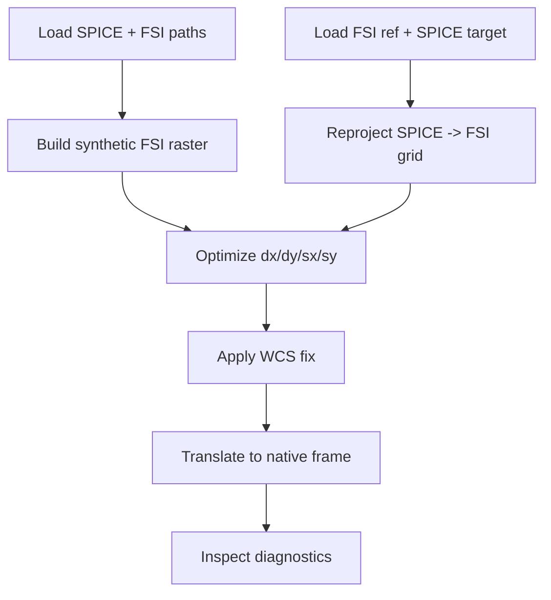
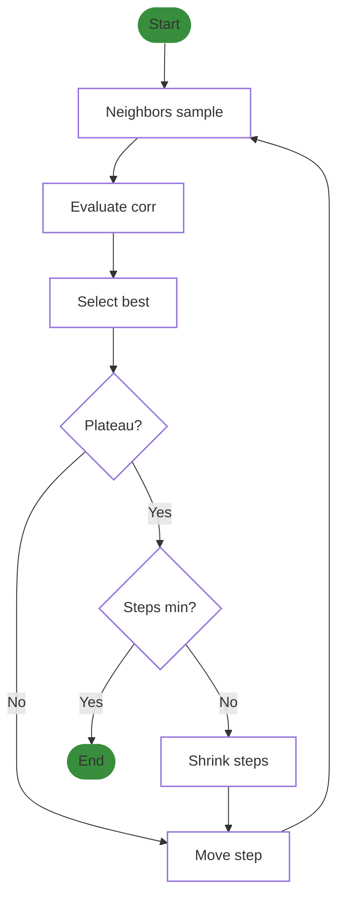
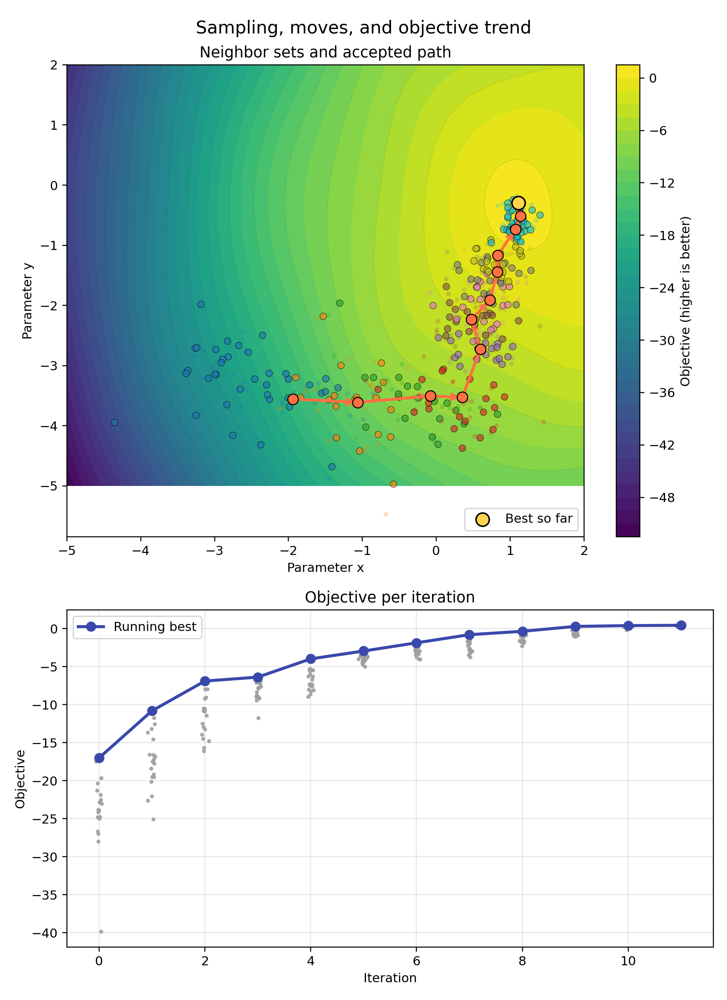

# Cross-correlation and WCS Correction

## Credits / Inspiration
This work was inspired by open-source alignment tools and code snippets by:
- [Antoine Dolliou](https://github.com/adolliou/euispice_coreg)
- [Gabriel Pelouze](https://git.ias.u-psud.fr/gpelouze/align_images/-/tree/master)
- [Frédéric Auchère](http://git.ias.u-psud.fr/fauchere)

## Diagram


## Overview
This module aligns SPICE rasters to FSI reference maps via image-domain cross-correlation. The workflow:
1. Reproject the target (SPICE) map onto the reference (FSI) grid.
2. Optimize geometric parameters (shift and isotropic/aniso scale) to maximize normalized correlation between the reference image and the transformed target.
3. Encode the optimal pixel-domain transformation into the target map metadata (WCS) and, when needed, transform back into the original target frame.

Key functions are documented below.

## Optimizer: `optimize_alignment_local_grad_disc_persworkers`
This discrete, stochastic hill-climber searches a 4D parameter space `(dx, dy, sx, sy)` where `dx, dy` are pixel shifts and `sx, sy` are pixel scales. It maximizes `correlation_for_params`, which computes a NaN-safe normalized correlation between the reference image and a transformed target.

**Inputs (selected):**
- `ref_img`, `target_img`: 2D arrays on the same grid.
- `dx0, dy0, squeeze_x0, squeeze_y0`: initial shift/scale guesses.
- `step_*`: initial per-parameter step sizes; zero freezes a parameter.
- `min_step_*`: lower bounds for step sizes.
- `squeeze_*_bounds`, `shift_range`: hard bounds on parameters.
- `n_neighbors`: number of neighbors sampled per iteration.
- `max_iter`: iteration cap.
- `center`: optional (cy, cx) for scaling about a chosen point.
- `n_jobs`: number of worker processes for parallel correlation evaluations.
- Plateau controls: `corr_atol`, `corr_rtol`, `plateau_iters`, `shrink_factor_*`.

**Algorithm (per iteration):**
1. **Neighbor generation:** integer lattice offsets (precomputed) are scaled by current step sizes to propose neighbors around the current point, respecting bounds and frozen dims.
2. **Parallel evaluation:** each candidate `(dx, dy, sx, sy)` is evaluated via persistent worker processes that reuse loaded arrays and center parameters to avoid IPC overhead. Results are cached by rounded parameter tuples to skip duplicate work.
3. **Selection:** choose the best local candidate by correlation; track a global best.
4. **Gradient-like move:** compute a correlation-weighted mean of the sampled population; the difference from the previous mean defines a direction. Propose a step along this direction with length scaled to the correlation level; accept if it is no worse than the local best, else fall back to the local best. Frozen parameters are masked out in this move.
5. **Plateau detection and step shrink:** monitor the spread of recent best correlations. If the spread is below `corr_atol + corr_rtol*|mean|` for `plateau_iters` windows, shrink steps (divide by `shrink_factor_*` or jump to `min_step_*` when the factor is `None`). Stop when the plateau persists and all active steps are at their minima.

**Outputs:**
- `best_params`: dict with `dx`, `dy`, `squeeze_x`, `squeeze_y`, and final `corr` at the last accepted center.
- `history`: array of sampled points with columns `[iteration, dx, dy, squeeze_x, squeeze_y, corr]` for diagnostics (scatter/trace plots).



  

## Correlation metric: `correlation_for_params`
The optimizer maximizes a NaN-safe, mean-centered, normalized cross-correlation between the reference image `R` and the transformed target `T`. Let `M` be the mask of finite pixels (`1` where both images are finite, `0` otherwise). The correlation is:


```math
\mathrm{corr} = \frac{\sum_{i,j} M_{ij}\,(R_{ij}-\bar{R})\,(T_{ij}-\bar{T})}{\sqrt{\sum_{i,j} M_{ij}\,(R_{ij}-\bar{R})^2}\;\sqrt{\sum_{i,j} M_{ij}\,(T_{ij}-\bar{T})^2}}
```
where $\bar{R}$ and $\bar{T}$ are means computed only over the masked finite pixels. If the denominator is zero or no valid pixels remain, the function returns zero. The value lies in $[-1,1]$ by construction.

Interpretation:
- `corr = 1`: perfect positive linear correspondence over valid pixels.
- `corr = 0`: no linear correlation (or insufficient variance/valid pixels, which also returns 0).
- `corr = -1`: perfect negative linear correspondence.

## WCS correction: `make_corrected_wcs_map`
Takes the pixel-domain optimum (`best_params`) and constructs a new SunPy `Map` whose metadata encodes the shift/scale without resampling data. Internally calls `build_corrected_wcs_meta_scale_shift` to update `CDELT` (scale) and `CRVAL` (pointing) consistent with the pixel transform. The data array is reused unchanged; only WCS is adjusted.

## Frame translation: `find_original_correction`
Given a corrected map, an uncorrected map, and the original target frame, this function expresses the found correction in the target frame:
- Transforms pointing between coordinate frames using `SkyCoord` and pixel/ world conversions.
- Derives the scale ratios between corrected and uncorrected CDELT values and applies them to the target frame.
- Produces a new `Map` in the target frame with updated `CRVAL`/`CDELT` while preserving data and plot settings. This is useful to apply the alignment solution back onto the native raster frame for downstream products.


## Typical usage
1. Reproject SPICE onto FSI: `reproject_map_to_reference`.
2. Optimize alignment: `best_params, history = optimize_alignment_local_grad_disc_persworkers(...)`.
3. Apply WCS-only correction on the reprojected map: `make_corrected_wcs_map`.
4. Translate the correction to the original SPICE frame: `find_original_correction`.
5. Inspect diagnostics with `plot_alignment_before_after`, `plot_history_scatter`, and `correlation_with_iteration`.

## Synthetic raster generation (FSI -> SPICE geometry)
When SPICE lacks a well-matched reference, you can synthesize a raster from time-adjacent FSI frames so the alignment runs SPICE-on-FSI in a like-for-like geometry.

Workflow (conceptual):
1. Collect EUI/FSI maps spanning the SPICE raster time window (see `get_EUI_paths`).
2. For each SPICE column time stamp, pick the nearest FSI map (`_nearest_imager_index`) and reproject it to the SPICE frame at that time.
3. Insert the interpolated column into the synthetic raster array; preserve NaNs where coverage is missing.
4. Return a SunPy `Map` whose data mimics a SPICE raster sampled from FSI.


## Notes
- Correlation is NaN-robust; invalid pixels do not bias the score.
- Bounds and frozen parameters are enforced per dimension; use zero step sizes to lock parameters.
- Parallel mode uses persistent workers; wrap calls under `if __name__ == "__main__":` in scripts to avoid multiprocessing issues.

