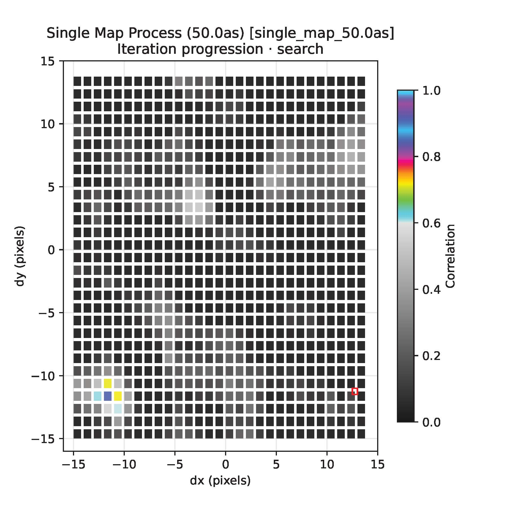
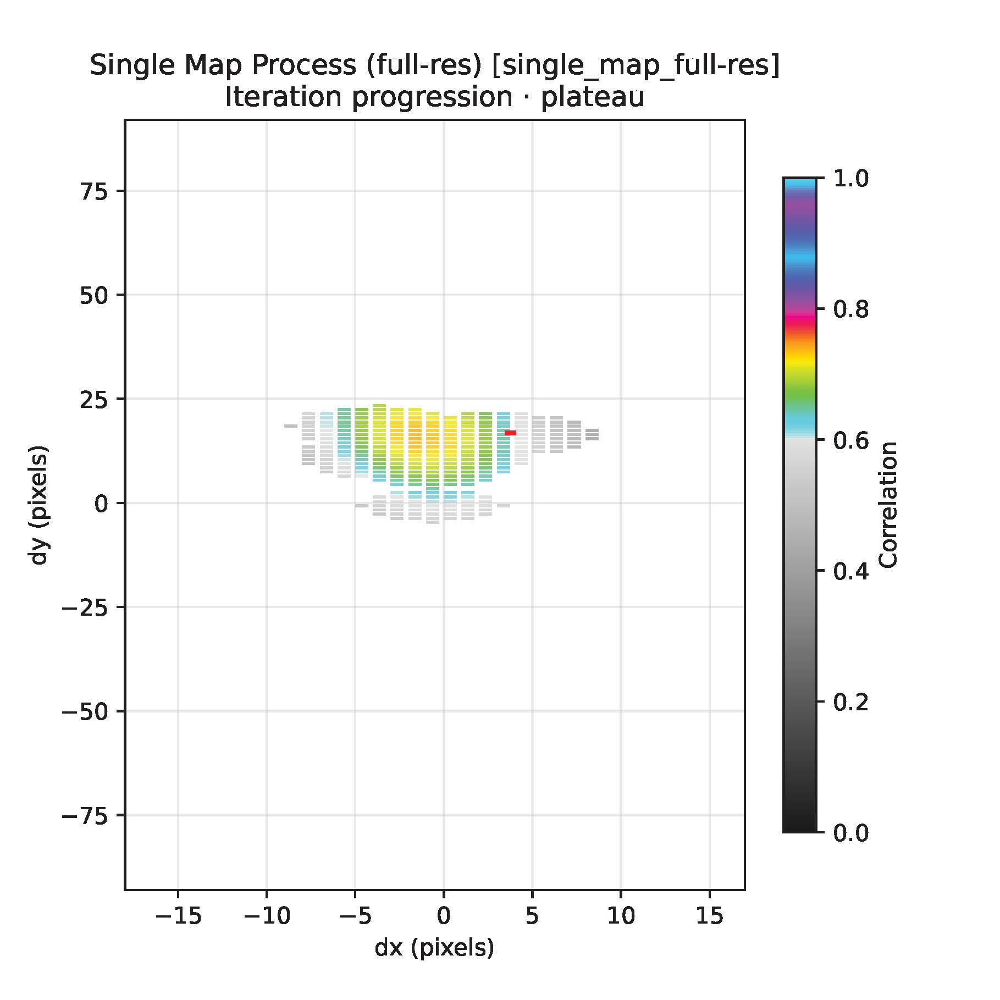
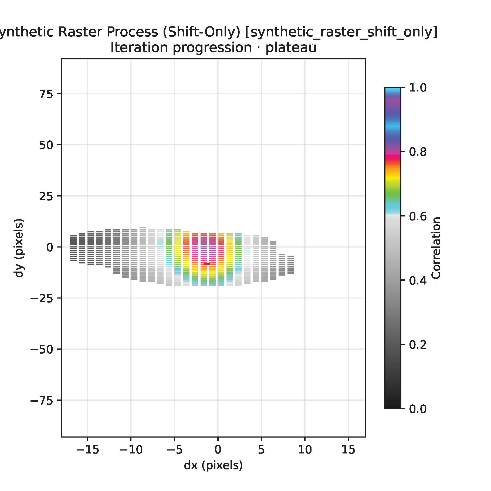
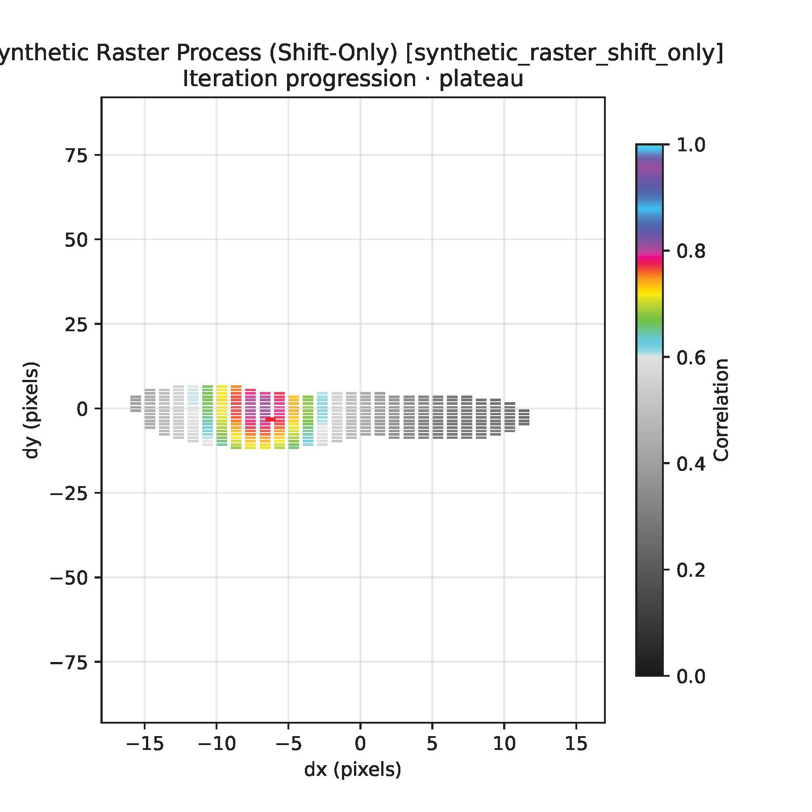
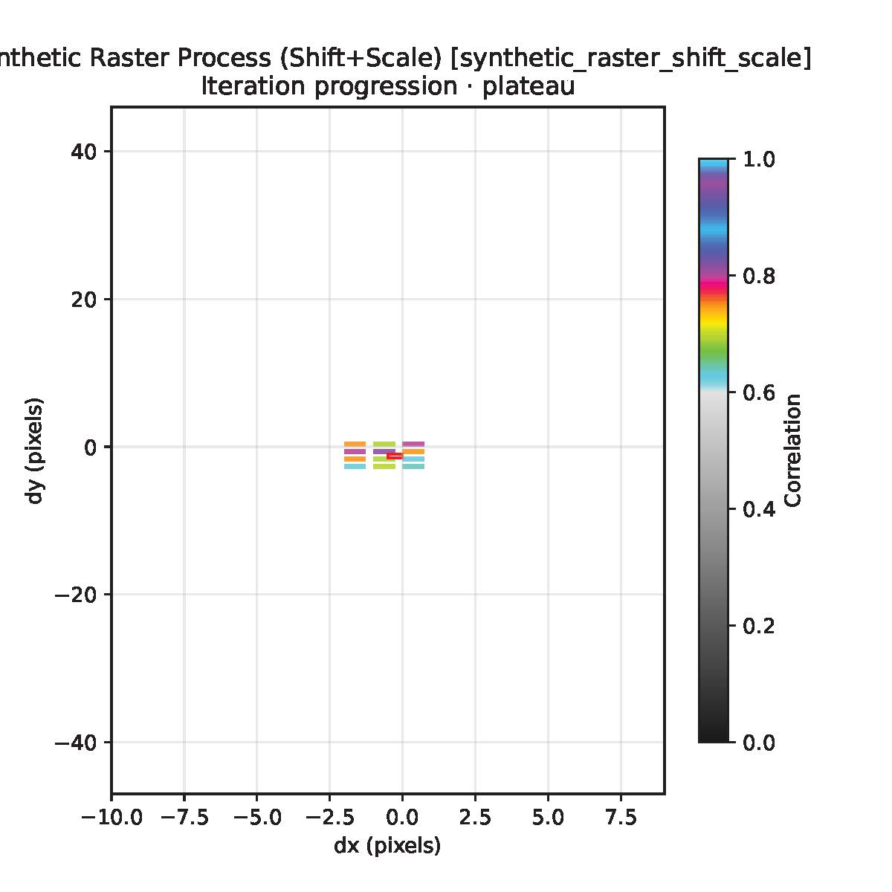

# SunXCorr

[](https://github.com/slimguat/SunXCorr/releases)
[](https://pypi.org/project/SunXCorr)
[](https://github.com/slimguat/SunXCorr/blob/main/LICENSE)
[](https://github.com/slimguat/SunXCorr/actions)
[](https://www.python.org)
[](https://github.com/slimguat/SunXCorr/issues)

SunXCorr is a Python toolkit for automated cross-correlation and WCS correction of solar FITS images. It estimates relative translations, and optional small scale adjustments, between SunPy maps and updates the corresponding WCS metadata.

The package is designed for solar image coalignment workflows where reproducible FITS/WCS handling, staged refinement, and diagnostic outputs are required.

## Table of Contents

- [Installation](#installation)
- [Quick Verification](#quick-verification)
- [Core Concepts](#core-concepts)
- [Minimal Correlation Example](#minimal-correlation-example)
- [Single Map Alignment](#single-map-alignment)
- [Synthetic Raster Alignment](#synthetic-raster-alignment)
- [Orchestrated Multi-Step Pipeline](#orchestrated-multi-step-pipeline)
- [Example Results](#example-results)
- [Process Output](#process-output)
- [Testing and Static Checks](#testing-and-static-checks)
- [Git LFS Data](#git-lfs-data)
- [Troubleshooting](#troubleshooting)
- [Credits](#credits)

---

## Installation

Clone the repository:

```bash
git clone https://github.com/slimguat/SunXCorr.git SunXCorr
cd SunXCorr
```

Create and activate a Python environment:

```bash
python -m venv .venv
source .venv/bin/activate
python -m pip install --upgrade pip
```

On Windows:

```cmd
python -m venv .venv
.\.venv\Scripts\activate
python -m pip install --upgrade pip
```

Install the package:

```bash
pip install .
```

For development:

```bash
pip install -e .
```

---

## Quick Verification

```bash
python -c "import sunxcorr; print('sunxcorr import OK')"
```

---

## Core Concepts

SunXCorr provides two main alignment modes:

- **Single map alignment**: estimates translations between a target map and a reference map. This mode is useful for wide shift searches, especially when the reference map is larger than the target.
- **Synthetic raster alignment**: estimates translations and optional scale corrections using a synthetic raster built from a sequence of maps. This mode is suited for refined alignment after an initial coarse correction.

The general workflow is:

1. Run a coarse search over a large shift range.
2. Refine the solution with a smaller search range and finer sampling.
3. Optionally use synthetic raster steps to improve the solution and search for small scale corrections.

### FITS Metadata Requirements

Input maps must contain the WCS and time-axis metadata required by the correction procedure. In particular:

- `CRVAL3`: time reference value, in seconds relative to `DATE-REF`.
- `CDELT3`: time-axis pixel scale, typically `1`.
- `CUNIT3`: time-axis unit, for example `"s"`.
- `PC3_1` or the relevant WCS PC matrix entries: may encode exposure or scan direction information.

---

## Minimal Correlation Example

```python
from sunxcorr.correlation_jit import correlation_for_params_jit
import numpy as np

# Prepare small synthetic maps. See tests for more complete examples.
map1 = np.ones((64, 64), dtype=np.float32)
map2 = np.ones((64, 64), dtype=np.float32)

result = correlation_for_params_jit(
    map1,
    map2,
    dx=0.0,
    dy=0.0,
    squeeze_x=1.0,
    squeeze_y=1.0,
)

print(result)
```

---

## Single Map Alignment

Use `SingleMapProcess` when the target map must be aligned against one reference map.

```python
from sunxcorr import SingleMapProcess
import astropy.units as u
from sunpy.map import Map
from pathlib import Path

xcorr_single = SingleMapProcess(
    max_shift=100.0 * u.arcsec,        # required: astropy Quantity
    bin_kernel=1.0 * u.arcsec,         # required: astropy Quantity; if >1, data are binned
    max_corr=0.0,                      # correlation threshold for early stopping
    plateau_iters=2,                   # stop if the top correlation repeats plateau_iters times
    n_workers=1,                       # default 1; increase for parallel runs
    verbose=4,                         # diagnostic verbosity
)

xcorr_single.node_id = "example_single"
xcorr_single.name = "single_coalign"
xcorr_single.target_map = Map("Path/to/your/target_map.fits")
xcorr_single.reference_map = Map("Path/to/your/reference_map.fits")
xcorr_single.output_directory = Path("./data_storage/debug_output")

xcorr_single.execute()
result = xcorr_single.get_final_result()
```

The corrected map is available in:

```python
result.output_map
```

---

## Synthetic Raster Alignment

Use `SyntheticRasterProcess` when the reference is built from a sequence of maps rather than a single reference map. This mode also supports small scale corrections.

```python
from sunxcorr import SyntheticRasterProcess
import astropy.units as u
import os

xcorr_synth = SyntheticRasterProcess(
    max_shift=100.0 * u.arcsec,
    scale_step=0.00,                 # 0.0 means no scale search
    n_neighbors=os.cpu_count() * 2,  # local search density
    plateau_iters=2,
)

# Add inputs, then execute as with SingleMapProcess.
# Instead of setting xcorr_single.reference_map, set:
xcorr_synth.reference_sequence = [list_maps_or_paths]  # list of SunPy maps or paths to maps
```

`scale_step` is a unitless increment for the scale factor, where `1.0` corresponds to no scaling.

---

## Orchestrated Multi-Step Pipeline

The orchestrator can combine several alignment stages. The example below first performs a wide search, then progressively refines the solution with smaller shifts, synthetic raster alignment, and a final scale search.

```python
import os
import astropy.units as u
from sunxcorr import SingleMapProcess, SyntheticRasterProcess, Orchestrator

root = Orchestrator(n_workers=os.cpu_count())
# Same data preparation as before: add `.reference_map` if the Orchestrator is using `SingleMapProcess`,
# add `.reference_sequence` if using `SyntheticRasterProcess`, or provide both when the pipeline mixes process types.

# 1. coarse wide-range search (works even if the target is far away)
root.add_child(SingleMapProcess(
    max_shift=700.0 * u.arcsec,
    bin_kernel=50.0 * u.arcsec,
    n_neighbors=48,
    max_corr=0.7,
))

# 2. refine in smaller space without binning
root.add_child(SingleMapProcess(
    max_shift=100.0 * u.arcsec,
    bin_kernel=1.0 * u.arcsec,
    n_neighbors=os.cpu_count()*2,
))

# 3. synthetic raster (no scale) to improve results
root.add_child(SyntheticRasterProcess(
    max_shift=100.0 * u.arcsec,
    scale_step=0.00,
    n_neighbors=os.cpu_count()*2,
    plateau_iters=2,
))

# 4. recompute synthetic raster with more neighbors
root.add_child(SyntheticRasterProcess(
    max_shift=100.0 * u.arcsec,
    scale_step=0.00,
    n_neighbors=os.cpu_count()*2,
    plateau_iters=2,
))

# 5. final scaling search in a tighter space (scale around 1.2 - 1.8 no need for more in SPICE and this is the default range)
root.add_child(SyntheticRasterProcess(
    max_shift=50.0 * u.arcsec,
    scale_step=0.01,
    n_neighbors=os.cpu_count()*2,
    plateau_iters=2,
))

root.execute()
root.cleanup()  # close workers and clean up resources after execution; close debug PDF files if `verbose` >= 3
```

---

## Example Results

The figures below show a five-step alignment sequence for a map artificially shifted by 500 arcsec in both directions.

### Step 1: Coarse Wide-Range Search

The first stage explores a large search space and identifies the correct coarse solution.



### Step 2: Fine Single-Map Refinement

The second stage refines the solution in a smaller search space without binning.



### Step 3: Synthetic Raster Refinement

The third stage uses a synthetic raster to improve the match.



### Step 4: Additional Synthetic Raster Refinement

The fourth stage recomputes the synthetic-raster alignment with more neighbors.



### Step 5: Final Scale Search

The final stage searches for small scale corrections in a tighter shift range.



### Final Map Comparison

The final comparison shows the map coordinates before and after the correction sequence.


---

## Process Output

`get_final_result()` returns a `ProcessResult`-like object containing the alignment output and diagnostics.

Common fields include:

- `process_id`: unique process identifier
- `process_name`: human-readable process name
- `input_map`: input `sunpy.map.GenericMap`
- `output_map`: corrected `sunpy.map.GenericMap`
- `shift_arcsec`: best-fit shift in arcseconds `(dx, dy)`
- `shift_pixels`: best-fit shift in pixels `(dx, dy)`
- `scale_factors`: scale factors `(sx, sy)`, where `1.0` means no scaling
- `correlation_peak`: best correlation score
- `search_space_explored`: number of candidates evaluated
- `iteration_count`: number of optimization iterations
- `execution_time`: execution time in seconds
- `debug_pdf_path`: optional diagnostic PDF path
- `animation_path`: optional output animation path
- `reference_reprojected`: optional reprojected reference map
- `extra_data`: additional process-specific outputs
- `history`: per-iteration diagnostics
- `iterations`: iteration details or iteration count

---

## Testing and Static Checks

Install development dependencies, then run the tests:

```bash
poetry install --with dev
python -m pytest
```

For older Poetry versions:

```bash
poetry install --dev
python -m pytest
```

With `pip`:

```bash
pip install -e .
pip install -U pytest
python -m pytest
```

A quick test runner is also available:

```bash
python tests/run_tests_quick.py
```

---

## Git LFS Data

Some test and example data are stored with Git LFS. After cloning the repository, fetch the LFS-managed files before running data-dependent tests:

```bash
git lfs install --local
git lfs pull
```

To clone without downloading LFS files immediately:

```bash
GIT_LFS_SKIP_SMUDGE=1 git clone https://github.com/slimguat/SunXCorr.git SunXCorr
cd SunXCorr
git lfs install --local
git lfs pull
```

To fetch only selected paths:

```bash
git lfs pull --include="fits_files/**"
```

---

## Troubleshooting

If tests fail because example FITS files are missing, ensure that Git LFS is installed and that the LFS files have been pulled:

```bash
git lfs install --local
git lfs pull
```

If `pytest` hangs during collection, use the quick runner or run individual tests to isolate the issue:

```bash
python tests/run_tests_quick.py
python -m pytest path/to/test_file.py -v
```

On Windows PowerShell, script execution may block virtual-environment activation. You can either use `cmd.exe` activation or run:

```powershell
Set-ExecutionPolicy -Scope CurrentUser -ExecutionPolicy RemoteSigned -Force
```

---

## Credits

This work was inspired by open-source alignment tools and code snippets by:

- [Antoine Dolliou](https://github.com/adolliou/euispice_coreg)
- [Gabriel Pelouze](https://git.ias.u-psud.fr/gpelouze/align_images/-/tree/master)
- [Frédéric Auchère](http://git.ias.u-psud.fr/fauchere)
